# FDIC
### A binary frequency dictionary format

The goal of this format is to optimize for both on-disk size, as well as loading speed.

The bulk of the size reduction comes from GZIPing it, but there is one additional trick which
serves both purposes: [Variable Length longs](variable-length-longs).

## Getting started
`.fdic` files can be generated using the [fdic cli](../FdicCli/README.md) program. And can be loaded using
the `FrequencyDictionaryIO` class in this project, or if using SymSpellKt, via conscience functions in
[SymSpellFdic](../SymSpellKtFdic/README.md).

Add to your project from Maven Central:

`implementation("com.darkrockstudios:fdic:3.1.0)`

The use `FrequencyDictionaryIO` to read and write `.fdic` files:
```kotlin
// Read
val dictionary = FrequencyDictionaryIO.readFdic("en-80k.fdic")
val dictionary = FrequencyDictionaryIO.readFdic(en80kByteArray)

// Write
val dictionary: FrequencyDictionary
FrequencyDictionaryIO.writeFdic(dictionary, "en-80k.fdic")
```

## Performance
Performance varies greatly depending on the combination of machine and dictionary being decoded. But `fdic` is always
superior in both size and speed to both a plain text dictionary, and a GZIPed text dictionary.

Some Machine/Dictionary combinations show more modest speed improvements, but considering simply GZIPing would have
increased decoding time over a plain text file, fdic shows a clear advantage in that it runs faster than a GZIPed
dictionary, and is much smaller than a plain text dictionary. So it's a win/win.

```
Binary Frequency Dictionary Compression
---------------------------------------

Speed:
------
 txt took 77ms to load
  gz took 83ms to load
fdic took 20ms to load

Summary:
fdic was 57ms (74.03%) faster!

Compression:
------------
 txt size: 1330 KB
  gz size: 592 KB
fdic size: 580 KB

Summary:
fdic was 43.65% of the original size
```

## File Layout

| Field | Size | Description |
|-------|------|-------------|
| Magic Number | 4 bytes | Fixed value 0x0F0D010C |
| Version | 1 byte | File format version |
| | **--- GZip Compressed Section Begins ---** | |
| ngram | vlong 1-10 bytes | Value of 1 (unigrams) or 2 (bigrams) |
| termCount | vlong 1-10 bytes | Number of dictionary entries that follow |
| locale | nstring len+1 bytes | Language locale of the dictionary |
| | **--- Dictionary Entries Begin ---** | |
| | **-- Dictionary Entry --** _(Repeated n times)_ | |
| frequency | vlong 1-10 bytes | Term Frequency (vlong) |
| term | nstring len+1 bytes | The dictionary term |

```mermaid
flowchart TD
    subgraph header[Uncompressed Header]
        magic["4 bytes: Magic Number (0x0F0D010C)"]
        version["1 byte: Version"]
        magic --> version
    end
    
    subgraph compressed[GZip Compressed Section]
        meta_ngram["vlong: ngram (1=unigrams, 2=bigrams)"]
        meta_count["vlong: termCount"]
        meta_locale["nstring: locale"]
        
        subgraph entries[Dictionary Entries Section]
            direction TB
            entry1["Entry 1:<br />vlong,  nstring<br />(frequency, term)"]
            entry2["Entry 2:<br />vlong,  nstring<br />(frequency, term)"]
            entry3["..."]
            entryN["Entry N:<br />vlong,  nstring<br />(frequency, term)"]
            
            entry1 --> entry2 --> entry3 --> entryN
        end
        
        meta_ngram --> meta_count --> meta_locale --> entries
    end
    
    header --> compressed

    style header fill:#151c3d
    style compressed fill:#0e2b1e
    style entries fill:#303030
```



## Variable Length Longs

### Why
In order to improve parsing performance, I wanted to store the Frequency numbers as a binary Integer, so
parsing it was as simple as reading the bytes and assigning to an Int.

But this actually increased overall file size!

It turns out the first couple of terms really do need to be represented by more than 4 bytes, such as "the" in
English: `the 26548583149`

By just the 7th term, we're already under the threshold for an unsigned int: `is 4192081707`

It took 11 characters to represent the frequency for `the`, so 8 bytes for a Long was still a savings, but by the time
we get to `is` it only takes 10 characters, still a savings, but reduced. Meanwhile we only actually need 4 bytes of
Integer precision to represent the frequency for `is`.

Pretty quickly the terms require fewer than 8 characters to represent their frequency, so representing it as a binary
number, even a 4 byte Int, begins to increase the overall size of each entry.

To solve this I came up with `Variable Length Longs` which only take as many bytes as necessary, the smallest numbers
requiring just 1 byte when encoded.

This results in an average savings of 3-4 bytes per entry.

### How
This is achieved by using the **Most Significant Bit** (_MSB_) as a `Continuation Flag` when parsing. This means that each
encoded byte only represents 7 bits of data, meaning in worst case scenarios we could use up to 10 bytes to represent
an 8 byte Long. In this use case it never occurs, as term frequencies are never that large.

When we begin reading a `vlong` field, we mask out the continuation bit, take the 7 data bits, shift them depending on
how many bytes we've read so far for this vlong, and add that to an accumulator Long.

```mermaid
flowchart TD
    subgraph title[Decoding a VLong]
        note["Each byte:<br>┌ MSB = Continuation bit (1=more bytes, 0=last byte)<br>└ Lower 7 bits = Data"]
        
        subgraph example["Example: Large Number Encoding"]
            direction TB
            byte1["Byte 1:<br>1|0000010<br>↓   └─7 bits data (2)─┘<br>Continue"]
            acc1["Accumulator: 2<br>Bits: 0000000 0000010"]
            
            byte2["Byte 2:<br>1|0000001<br>↓   └─7 bits data (1)─┘<br>Continue"]
            acc2["Accumulator: (2 << 7) | 1 = 257<br>Bits: 0000001 0000010"]
            
            byte3["Byte 3:<br>0|0000011<br>↓   └─7 bits data (3)─┘<br>Stop"]
            acc3["Final Accumulator: (257 << 7) | 3 = 32,899<br>Bits: 0000011 0000001 0000010"]
            
            byte1 --> acc1 --> byte2 --> acc2 --> byte3 --> acc3
        end
    end

    style title fill:#333333
    style example fill:#0d2236
```


