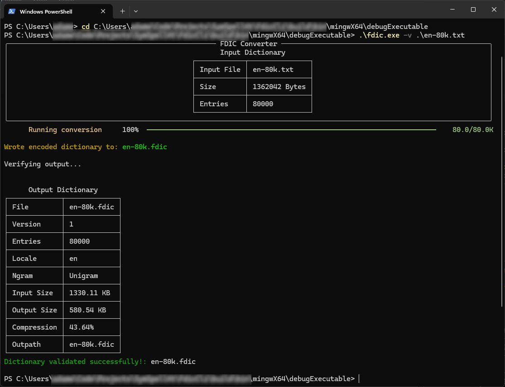

# Fdic CLI
This is a command line interface for encoding plain text frequency dictionaries into the `.fdic` format.



## Help
```
> fdic.exe --help
Usage: fdic-converter [<options>] <path> [<out>]

Options:
  -n, --ngram=<int>    The number of grams in each entry. 1 for Unigram, 2 for Bigram
  -l, --locale=<text>  The locale tag and any qualifiers of this dictionary. This can be any valid Locale tag such as
                       en-US, de and so on
  -v, --verify         Read back the dictionary after it is written to validate it is correct
  -h, --help           Show this message and exit

Arguments:
  <path>  Path to the plain text frequency dictionary to be converted
  <out>   Output path of the encoded file to be written
```