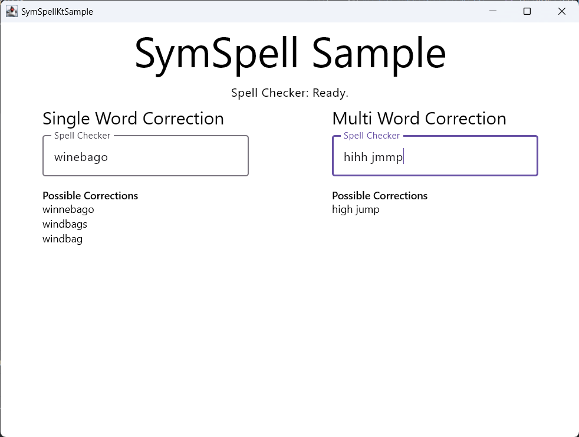

# SymSpell Spell Check Kotlin

![badge-jvm] ![badge-android] ![badge-wasm] ![badge-wasmi] ![badge-jsir] ![badge-linux] ![badge-windows] ![badge-mac-x86] ![badge-mac-arm]
![badge-ios] ![badge-ios-sim]

_This is a Kotlin Multiplatform implementation of the [symspell](https://github.com/wolfgarbe/symspell) fuzzy search
algorithm. It has been ported from this [Java implementation](https://github.com/MighTguY/customized-symspell/) of symspell._

## Dependency

`implementation("com.darkrockstudios:symspellkt:3.3.0")`

## Sample

Try out the sample desktop application:

`gradlew sampleCompose:run`

[Try sample here](https://wavesonics.github.io/SymSpellKt/)

## SymSpell v6.6 (Bigrams)

* the optional bigram dictionary in order to use sentence level context information for selecting best spelling
  correction.

## SymSpell

* The Symmetric Delete spelling correction algorithm reduces the complexity of edit candidate generation and dictionary
  lookup for a given Damerau-Levenshtein distance.
* It is six orders of magnitude faster (than the standard approach with deletes + transposes + replaces + inserts) and
  language independent.
* Opposite to other algorithms only deletes are required, no transposes + replaces + inserts. Transposes + replaces +
  inserts of the input term are transformed into deletes of the dictionary term.
* The speed comes from the inexpensive delete-only edit candidate generation and the pre-calculation.

## Fdic: Binary Frequency Dictionary file format

In order to optimize for size on disk, and speed of loading and parsing, I made a little file format to encode the
common plain text frequency dictionaries use with SymSpell style spell checkers.

[fdic](Fdic/README.md) is both smaller on disk, and faster to load than either plain text or gzipped dictionaries. In some cases being:
- 70% faster to load and parse
- More than 40% smaller on disk.

There is a [CLI program](FdicCli/README.md) for producing `.fdic` files from a standard plain text frequency dictionary, as well as some 
extension functions in an [addon library](SymSpellKtFdic/README.md) for loading them into a SymSpellKt SpellChecker object.

[badge-android]: http://img.shields.io/badge/-android-6EDB8D.svg?style=flat
[badge-jvm]: http://img.shields.io/badge/-jvm-DB413D.svg?style=flat
[badge-js]: http://img.shields.io/badge/-js-F8DB5D.svg?style=flat
[badge-js-ir]: https://img.shields.io/badge/support-[IR]-AAC4E0.svg?style=flat
[badge-linux]: http://img.shields.io/badge/-linux-2D3F6C.svg?style=flat
[badge-windows]: http://img.shields.io/badge/-windows-4D76CD.svg?style=flat
[badge-wasm]: https://img.shields.io/badge/-wasm-624FE8.svg?style=flat
[badge-wasmi]: https://img.shields.io/badge/-wasi-626FFF.svg?style=flat
[badge-jsir]: https://img.shields.io/badge/-js(IR)-22D655.svg?style=flat
[badge-apple-silicon]: http://img.shields.io/badge/support-[AppleSilicon]-43BBFF.svg?style=flat
[badge-ios]: http://img.shields.io/badge/-ios-CDCDCD.svg?style=flat
[badge-ios-sim]: http://img.shields.io/badge/-iosSim-AFAFAF.svg?style=flat
[badge-mac-arm]: http://img.shields.io/badge/-macosArm-444444.svg?style=flat
[badge-mac-x86]: http://img.shields.io/badge/-macosX86-111111.svg?style=flat
[badge-watchos]: http://img.shields.io/badge/-watchos-C0C0C0.svg?style=flat
[badge-tvos]: http://img.shields.io/badge/-tvos-808080.svg?style=flat
