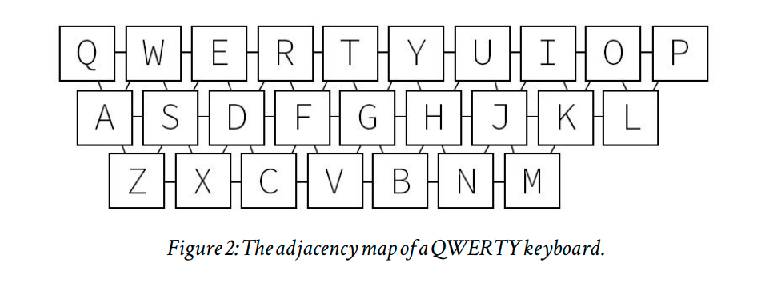

# SymSpell Spell Check Kotlin


[](https://search.maven.org/artifact/com.darkrockstudios/symspellkt)


[](http://kotlinlang.org)

[](http://kotlinlang.org)
![badge-jvm] ![badge-android] ![badge-wasm] ![badge-wasmi] ![badge-linux] ![badge-windows] ![badge-mac-x86] ![badge-mac-arm]
![badge-ios] ![badge-ios-sim]

_This is a Kotlin Multiplatform implementation of the [symspell](https://github.com/wolfgarbe/symspell) fuzzy search
algorithm. It has been ported from [Java implementation](https://github.com/MighTguY/customized-symspell/) of symspell._

## Dependency

`implementation("com.darkrockstudios:symspellkt:1.0.0")`

## Sample

Try out the sample desktop application:

`gradlew sampleCompose:run`


## SymSpell v6.6 (Bigrams)

* the optional bigram dictionary in order to use sentence level context information for selecting best spelling
  correction.

## SymSpell

* The Symmetric Delete spelling correction algorithm reduces the complexity of edit candidate generation and dictionary
  lookup for a given Damerau-Levenshtein distance.
* It is six orders of magnitude faster (than the standard approach with deletes + transposes + replaces + inserts) and
  language independent.
* Opposite to other algorithms only deletes are required, no transposes + replaces + inserts. Transposes + replaces +
  inserts of the input term are transformed into deletes of the dictionary term.
* The speed comes from the inexpensive delete-only edit candidate generation and the pre-calculation.

## Customizations

* We replaced the **Damerau-Levenshtein** implementation with a **weighted Damerau-Levenshtein** implementation: where
  each operation (delete, insert, swap, replace) can have different edit weights.
* We added some customizing "hooks" that are used to rerank the top-k results (candidate list). The results are then
  reordered based on a combined proximity
  * added keyboard-distance to get a dynamic replacement weight (since letters close to each other are more likely to be
    replaced)
  * do some query normalization before search

## Keyboard based  Qwerty/Qwertz Distance

There are 2 implementations of the keyboards one is English Qwerty based and other is German Qwertz based implementation
we used the adjancey graph of the keyboard for the weights to the connected nodes.



## Accuracy Summary

| Spellcorrection Strategy 	| Accuracy 	| Failures 	| TP   	| TN  	| FP  	| FN   	|
|--------------------------	|:--------:	|---------:	|------	|-----	|-----	|------	|
| LUCENE                   	|  78.96%  	|   21.04% 	| 5883 	| 481 	| 146 	| 1550 	|
| Vanilla SymSpell         	|  88.80%  	|   11.20% 	| 6888 	| 269 	| 358 	| 545  	|
| Weighted SymSpell        	|  75.74%  	|   24.26% 	| 5781 	| 324 	| 303 	| 1652 	|
| Qwerty Vanilla SymSpell  	| 88.57%   	| 11.43%   	| 6860 	| 279 	| 348 	| 573  	|
| Qwerty Weighted SymSpell 	| 75.36%   	| 24.64%   	| 5744 	| 330 	| 297 	| 1689 	|

### Example

```
For 2 terms: 
        slices  
        olives

If the misspelled word is, slives 
both slices and olives is 1 edit distance, 
  so in default case the one with higher frequency will end up in the result.
While with the qwerty based char distance,
 slives is more closer to slices.

The reason for this is in Qwerty Based Keyboard, 
 S and O are too far while V and C are adjacent.
```

## Generation of Deletes

Word deletes are generated with taking edit distance which is minimum of max edit distance and 0.3 * word.length

[badge-android]: http://img.shields.io/badge/-android-6EDB8D.svg?style=flat
[badge-jvm]: http://img.shields.io/badge/-jvm-DB413D.svg?style=flat
[badge-js]: http://img.shields.io/badge/-js-F8DB5D.svg?style=flat
[badge-js-ir]: https://img.shields.io/badge/support-[IR]-AAC4E0.svg?style=flat
[badge-linux]: http://img.shields.io/badge/-linux-2D3F6C.svg?style=flat
[badge-windows]: http://img.shields.io/badge/-windows-4D76CD.svg?style=flat
[badge-wasm]: https://img.shields.io/badge/-wasm-624FE8.svg?style=flat
[badge-wasmi]: https://img.shields.io/badge/-wasi-626FFF.svg?style=flat
[badge-apple-silicon]: http://img.shields.io/badge/support-[AppleSilicon]-43BBFF.svg?style=flat
[badge-ios]: http://img.shields.io/badge/-ios-CDCDCD.svg?style=flat
[badge-ios-sim]: http://img.shields.io/badge/-iosSim-AFAFAF.svg?style=flat
[badge-mac-arm]: http://img.shields.io/badge/-macosArm-444444.svg?style=flat
[badge-mac-x86]: http://img.shields.io/badge/-macosX86-111111.svg?style=flat
[badge-watchos]: http://img.shields.io/badge/-watchos-C0C0C0.svg?style=flat
[badge-tvos]: http://img.shields.io/badge/-tvos-808080.svg?style=flat